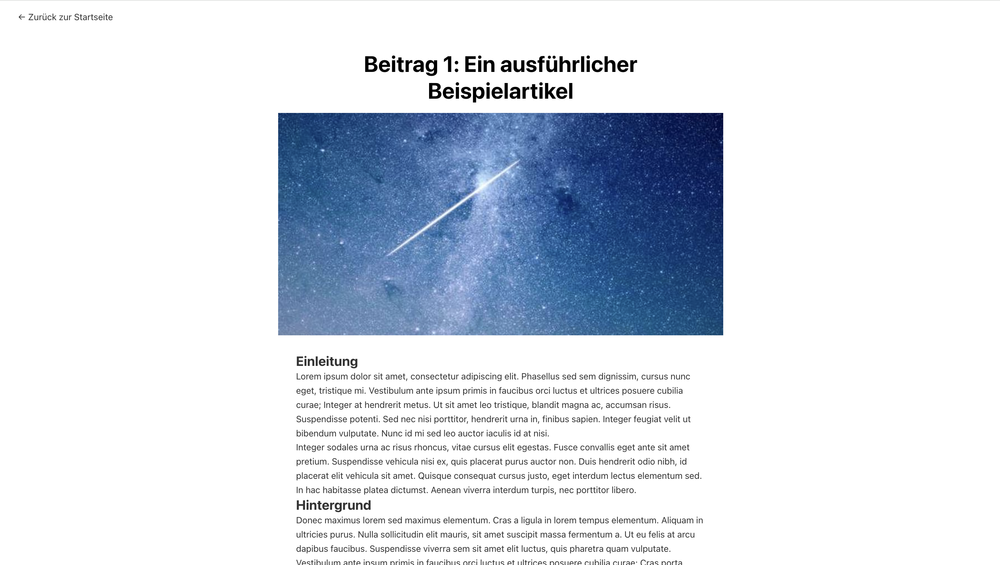

# Angular Blog Application

Eine moderne Blog-Anwendung entwickelt mit Angular 19.2.0 für Performance-Vergleiche zwischen verschiedenen Frontend-Frameworks.

## Was ist diese Anwendung?

Diese Angular-Anwendung ist ein vollständig funktionaler Blog mit 50 Artikeln, der speziell für Performance-Tests und Vergleiche zwischen verschiedenen Frontend-Frameworks entwickelt wurde. Die Anwendung demonstriert moderne Web-Entwicklungspraktiken und bietet eine realistische Testumgebung für Performance-Messungen.

### Screenshots

**Startseite - Blog-Übersicht:**


**Blog-Detailansicht:**


### Hauptfunktionen
- **Blog-Übersicht**: Zeigt alle 50 Artikel in einem responsiven Grid-Layout
- **Kommentarsystem**: Anzeige von Kommentaren


## Schnellstart mit Docker

### 1. Docker Image bauen

```bash
# Im Verzeichnis der Anwendung
cd ba_angular_blog

# Docker Image bauen
docker build -t angular-blog .

# Optional: Mit spezifischem Tag
docker build -t angular-blog:v1.0 .
```

### 2. Anwendung starten

```bash
# Container starten
docker run -d -p 8080:80 --name angular-blog-container angular-blog

# Oder mit Port-Mapping nach Wahl
docker run -d -p 3000:80 --name angular-blog-container angular-blog
```

### 3. Anwendung aufrufen

Öffnen Sie Ihren Browser und navigieren Sie zu:
- **Lokaler Port 8080**: `http://localhost:8080`
- **Oder Port 3000**: `http://localhost:3000` (falls Sie den Port geändert haben)

### 4. Container verwalten

```bash
# Container stoppen
docker stop angular-blog-container

# Container starten
docker start angular-blog-container

# Container entfernen
docker rm angular-blog-container

# Alle laufenden Container anzeigen
docker ps

# Container-Logs anzeigen
docker logs angular-blog-container
```

## Entwicklungsumgebung

### Voraussetzungen
- Node.js (Version 18 oder höher)
- npm oder yarn
- Angular CLI (global installiert)

### Lokale Entwicklung

```bash
# Dependencies installieren
npm install

# Entwicklungsserver starten
npm start
# Oder: ng serve

# Anwendung öffnet sich automatisch unter http://localhost:4200
```

### Build für Produktion

```bash
# Produktions-Build erstellen
npm run build
# Oder: ng build --configuration production

# Build-Verzeichnis: dist/ba-angular-blog/
```

## Docker-Konfiguration

### Dockerfile Details

Das Dockerfile verwendet einen mehrstufigen Build-Prozess:
1. **Build-Stage**: Node.js-basierter Build der Angular 19.2.0-Anwendung
2. **Production-Stage**: Nginx-basierter Webserver für optimale Performance

## Projektstruktur

```
ba_angular_blog/
├── src/                          # Angular-Quellcode
│   ├── app/
│   │   ├── blog-overview/        # Blog-Übersichtsseite
│   │   ├── blog-detail/          # Blog-Detailseite
│   │   └── services/             # Daten-Services
│   └── assets/
│       └── posts.json            # Blog-Daten (50 Artikel)
├── Dockerfile                    # Docker-Build-Konfiguration
├── nginx.conf                    # Nginx-Server-Konfiguration
├── package.json                  # Node.js-Dependencies
└── angular.json                  # Angular-Konfiguration
```

