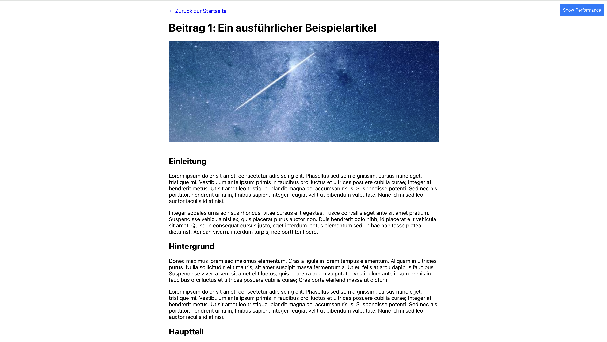

# React Blog Application

Eine moderne Blog-Anwendung entwickelt mit React 19.1.0 für Performance-Vergleiche zwischen verschiedenen Frontend-Frameworks.

## Was ist diese Anwendung?

Diese React-Anwendung ist ein vollständig funktionaler Blog mit 50 Artikeln, der speziell für Performance-Tests und Vergleiche zwischen verschiedenen Frontend-Frameworks entwickelt wurde. Die Anwendung demonstriert moderne Web-Entwicklungspraktiken und bietet eine realistische Testumgebung für Performance-Messungen.

### Screenshots

**Startseite - Blog-Übersicht:**


**Blog-Detailansicht:**


### Hauptfunktionen
- **Blog-Übersicht**: Zeigt alle 50 Artikel in einem responsiven Grid-Layout
- **Blog-Detailansicht**: Vollständige Artikelansicht mit Kommentaren

## Schnellstart mit Docker

### 1. Docker Image bauen

```bash
# Im Verzeichnis der Anwendung
cd ba_react_blog

# Docker Image bauen
docker build -t react-blog .

# Optional: Mit spezifischem Tag
docker build -t react-blog:v1.0 .
```

### 2. Anwendung starten

```bash
# Container starten
docker run -d -p 8080:80 --name react-blog-container react-blog

# Oder mit Port-Mapping nach Wahl
docker run -d -p 3000:80 --name react-blog-container react-blog
```

### 3. Anwendung aufrufen

Öffnen Sie Ihren Browser und navigieren Sie zu:
- **Lokaler Port 8080**: `http://localhost:8080`
- **Oder Port 3000**: `http://localhost:3000` (falls Sie den Port geändert haben)

### 4. Container verwalten

```bash
# Container stoppen
docker stop react-blog-container

# Container starten
docker start react-blog-container

# Container entfernen
docker rm react-blog-container

# Alle laufenden Container anzeigen
docker ps

# Container-Logs anzeigen
docker logs react-blog-container
```

## Entwicklungsumgebung

### Voraussetzungen
- Node.js (Version 18 oder höher)
- npm oder yarn

### Lokale Entwicklung

```bash
# Dependencies installieren
npm install

# Entwicklungsserver starten
npm start

# Anwendung öffnet sich automatisch unter http://localhost:3000
```

### Build für Produktion

```bash
# Produktions-Build erstellen
npm run build

# Build-Verzeichnis: build/
```
```

## Docker-Konfiguration

### Dockerfile Details

Das Dockerfile verwendet einen mehrstufigen Build-Prozess:
1. **Build-Stage**: Node.js 20 Alpine-basierter Build der React 19.1.0-Anwendung
2. **Production-Stage**: Nginx-basierter Webserver für optimale Performance

### Nginx-Konfiguration

Die Anwendung wird über Nginx ausgeliefert

## Projektstruktur

```
ba_react_blog/
├── src/                          # React-Quellcode
│   ├── App.js                    # Haupt-App-Komponente
│   ├── BlogOverview.js           # Blog-Übersichtsseite
│   ├── BlogDetail.js             # Blog-Detailseite
│   ├── PerformanceMonitor.js     # Performance-Überwachung
│   ├── blogData.json             # Blog-Daten (50 Artikel)
│   └── index.js                  # App-Einstiegspunkt
├── public/                       # Statische Assets
│   ├── index.html                # HTML-Template
│   ├── react_blog.png            # Blog-Detail Screenshot
│   └── react_startseite.png      # Startseite Screenshot
├── Dockerfile                    # Docker-Build-Konfiguration
├── nginx.conf                    # Nginx-Server-Konfiguration
└── package.json                  # Node.js-Dependencies
```
