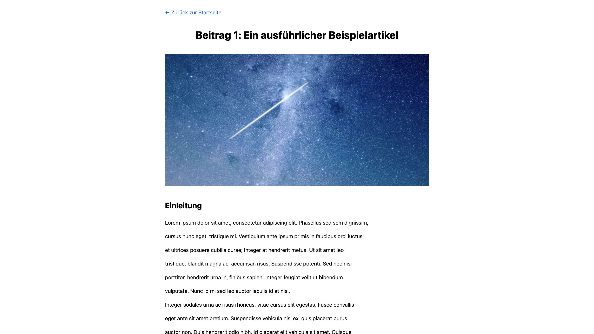

# Vue Blog Application

Eine moderne Blog-Anwendung entwickelt mit Vue 3.5.17 für Performance-Vergleiche zwischen verschiedenen Frontend-Frameworks.

## Was ist diese Anwendung?

Diese Vue-Anwendung ist ein vollständig funktionaler Blog mit 50 Artikeln, der speziell für Performance-Tests und Vergleiche zwischen verschiedenen Frontend-Frameworks entwickelt wurde. Die Anwendung demonstriert moderne Web-Entwicklungspraktiken und bietet eine realistische Testumgebung für Performance-Messungen.

### Hauptfunktionen
- **Blog-Übersicht**: Zeigt alle 50 Artikel in einem responsiven Grid-Layout
- **Blog-Detailansicht**: Vollständige Artikelansicht mit Kommentaren

### Screenshots

**Startseite - Blog-Übersicht:**


**Blog-Detailansicht:**


## Schnellstart mit Docker

### 1. Docker Image bauen

```bash
# Im Verzeichnis der Anwendung
cd ba_vue_blog

# Docker Image bauen
docker build -t vue-blog .

# Optional: Mit spezifischem Tag
docker build -t vue-blog:v1.0 .
```

### 2. Anwendung starten

```bash
# Container starten
docker run -d -p 8080:80 --name vue-blog-container vue-blog

# Oder mit Port-Mapping nach Wahl
docker run -d -p 3000:80 --name vue-blog-container vue-blog
```

### 3. Anwendung aufrufen

Öffnen Sie Ihren Browser und navigieren Sie zu:
- **Lokaler Port 8080**: `http://localhost:8080`
- **Oder Port 3000**: `http://localhost:3000` (falls Sie den Port geändert haben)

### 4. Container verwalten

```bash
# Container stoppen
docker stop vue-blog-container

# Container starten
docker start vue-blog-container

# Container entfernen
docker rm vue-blog-container

# Alle laufenden Container anzeigen
docker ps

# Container-Logs anzeigen
docker logs vue-blog-container
```

## Entwicklungsumgebung

### Voraussetzungen
- Node.js (Version 18 oder höher)
- npm oder yarn

### Lokale Entwicklung

```bash
# Dependencies installieren
npm install

# Entwicklungsserver starten
npm run dev

# Anwendung öffnet sich automatisch unter http://localhost:5173
```

### Build für Produktion

```bash
# Produktions-Build erstellen
npm run build

# Build-Verzeichnis: dist/
```

### Vorschau des Produktions-Builds

```bash
# Lokale Vorschau des Builds
npm run preview
```

## Docker-Konfiguration

### Dockerfile Details

Das Dockerfile verwendet einen mehrstufigen Build-Prozess:
1. **Build-Stage**: Node.js-basierter Build der Vue 3.5.17-Anwendung mit Vite
2. **Production-Stage**: Nginx-basierter Webserver für optimale Performance

### Nginx-Konfiguration

Die Anwendung wird über Nginx ausgeliefert

## Projektstruktur

```
ba_vue_blog/
├── src/                          # Vue-Quellcode
│   ├── views/                    # Vue-Komponenten
│   │   ├── BlogOverviewView.vue  # Blog-Übersichtsseite
│   │   ├── BlogDetailView.vue    # Blog-Detailseite
│   │   └── AboutView.vue         # Über-Seite
│   ├── router/                   # Vue Router-Konfiguration
│   │   └── index.js              # Router-Setup
│   ├── assets/                   # Statische Assets
│   │   ├── posts.json            # Blog-Daten (50 Artikel)
│   │   └── logo.svg              # Vue-Logo
│   ├── App.vue                   # Haupt-App-Komponente
│   └── main.js                   # App-Einstiegspunkt
├── public/                       # Öffentliche Assets
│   └── favicon.ico               # Favicon
├── Dockerfile                    # Docker-Build-Konfiguration
├── nginx.conf                    # Nginx-Server-Konfiguration
├── vite.config.js                # Vite-Build-Konfiguration
├── jsconfig.json                 # JavaScript-Konfiguration
└── package.json                  # Node.js-Dependencies
```
